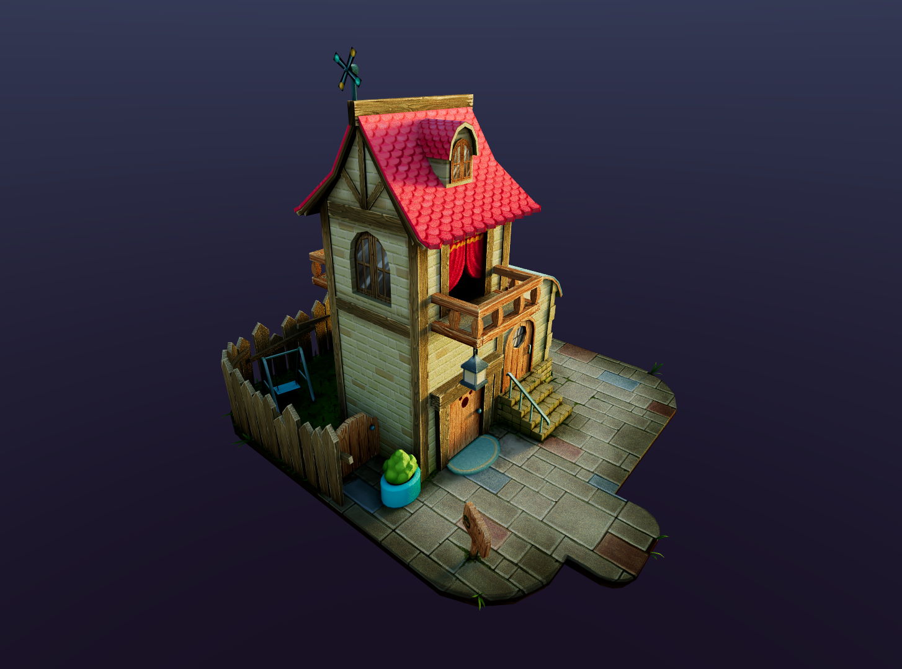
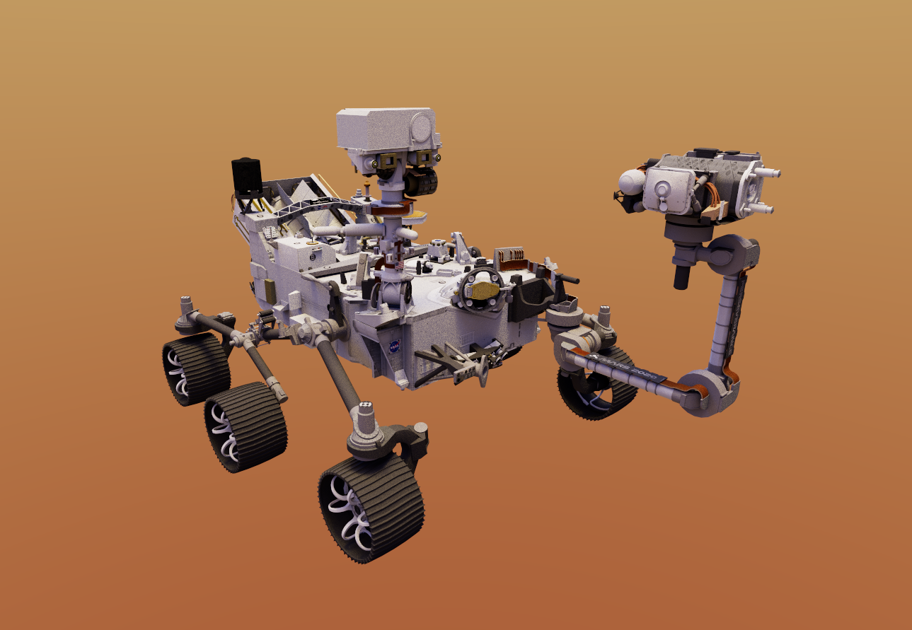
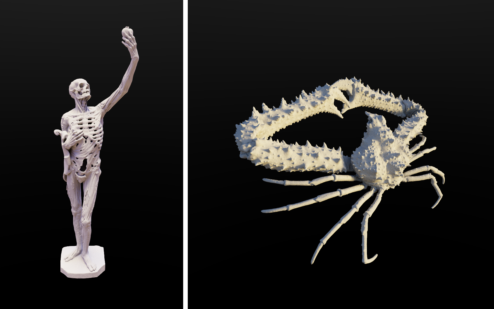
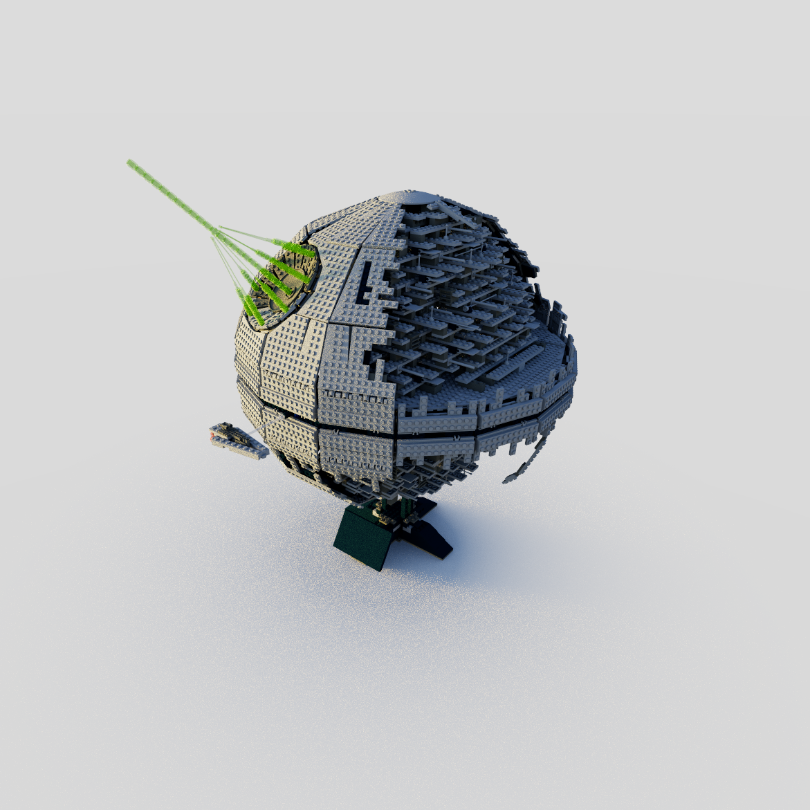
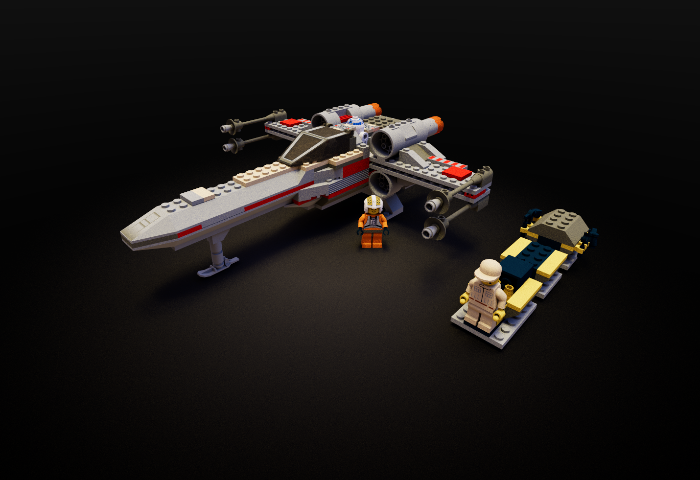
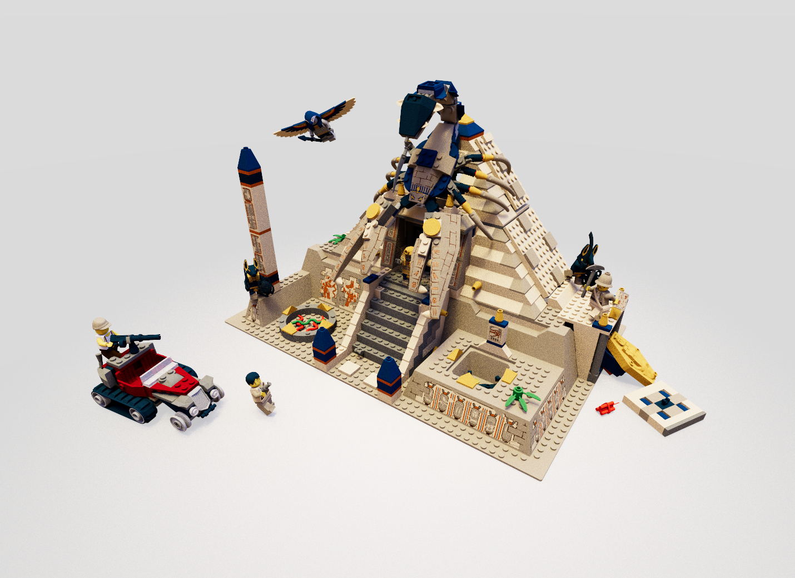

# three-gpu-pathtracer

[](https://lgtm.com/projects/g/gkjohnson/three-gpu-pathtracer/)
[](https://github.com/gkjohnson/three-gpu-pathtracer/actions)

Path tracing project using [three-mesh-bvh](https://github.com/gkjohnson/three-mesh-bvh) to accelerate high quality, physically based rendering on the GPU. Features include support for GGX surface model, material information, textures, normal maps, emission, environment maps, tiled rendering, and more!

_More features and capabilities in progress!_

# Examples

[Lambert demo here](https://gkjohnson.github.io/three-gpu-pathtracer/example/bundle/lambert.html)!

[Lego demo here](https://gkjohnson.github.io/three-gpu-pathtracer/example/bundle/lego.html)!

[Material demo here](https://gkjohnson.github.io/three-gpu-pathtracer/example/bundle/materialBall.html)!

[Transmission preset demo here](https://gkjohnson.github.io/three-gpu-pathtracer/example/bundle/materialBall.html#transmission)!

[Ambient Occlusion Material demo here](https://gkjohnson.github.io/three-gpu-pathtracer/example/bundle/aoRender.html)!

# Use

```js
import { FullScreenQuad } from 'three/examples/jsm/postprocessing/Pass.js';
import {
	PathTracingSceneGenerator,
	PathTracingRenderer,
	PhysicalPathTracingMaterial,
} from 'three-gpu-pathtracer';

// init scene, renderer, camera, controls, etc

// initialize the path tracing material and renderer
const ptMaterial = new PhysicalPathTracingMaterial();
const ptRenderer = new PathTracingRenderer( renderer );
ptRenderer.camera = camera;
ptRenderer.material = ptMaterial;

// init quad for rendering to the canvas
const fsQuad = new FullScreenQuad( new THREE.MeshBasicMaterial( {
	map: ptRenderer.target.texture,
} ) );

// initialize the scene and update the material properties with the bvh, materials, etc
const generator = new PathTracingSceneGenerator();
const { bvh, textures, materials } = await generator.generate( scene );

// update bvh and geometry attribute textures
ptMaterial.bvh.updateFrom( bvh );
ptMaterial.normalAttribute.updateFrom( geometry.attributes.normal );
ptMaterial.tangentAttribute.updateFrom( geometry.attributes.tangent );
ptMaterial.uvAttribute.updateFrom( geometry.attributes.uv );

// update materials and texture arrays
ptMaterial.materialIndexAttribute.updateFrom( geometry.attributes.materialIndex );
ptMaterial.textures.setTextures( renderer, 2048, 2048, textures );
ptMaterial.materials.updateFrom( materials, textures );
ptMaterial.setDefine( 'MATERIAL_LENGTH', materials.length );

// set the environment map
const texture = await new RGBELoader().loadAsync( envMapUrl );
const pmremGenerator = new THREE.PMREMGenerator( renderer );
pmremGenerator.compileCubemapShader();

const envMap = pmremGenerator.fromEquirectangular( texture );
ptRenderer.material.environmentMap = envMap.texture;

animate();

// ...

function animate() {

	// if the camera position changes call "ptRenderer.reset()"

	// update the camera and render one sample
	camera.updateMatrixWorld();
	ptRenderer.update();

	// copy the current state of the path tracer to canvas to display
	renderer.autoClear = false;
	fsQuad.material.map = ptRenderer.target.texture;
	fsQuad.render( renderer );
	renderer.autoClear = true;

}
```

# Exports

## PathTracingRenderer

Utility class for tracking and rendering a path traced scene to a render target.

### .samples

```js
readonly samples : Number
```

Number of samples per pixel that have been rendered to the target.

### .target

```js
readonly target : WebGLRenderTarget
```

The target being rendered to. The size of the target is updated with `setSize` and is initialized to a FloatType texture.

### .camera

```js
camera = null : Camera
```

The camera to render with. The view offset of the camera will be updated every sample to enable anti aliasing.

### .material

```js
material = null : ShaderMaterial
```

The Path Tracing material to render. This is expected to be a full screen quad material that respects the "opacity" field for every pixel so samples can be accumulated over time. The material is also expected to have `cameraWorldMatrix` and `invProjectionMatrix` fields of type `Matrix4`.

### .tiles

```js
tiles = ( 1, 1 ) : Vector2
```

Number of tiles on x and y to render to. Can be used to improve the responsiveness of a page while still rendering a high resolution target.

### .resetSeed

```js
resetSeed = false
```

Whether to reset the random seed to `0` when restarting the render. If true then a consistent random sample pattern will appear when moving the camera, for example.

### constructor

```js
constructor( renderer : WebGLRenderer )
```

### .setSize

```js
setSize( size : Vector2 ) : void
```

Sets the size of the target to render to.

### .update

```js
update()
```

Renders a single sample to the target.

### .reset

```js
reset() : void
```

Resets and restarts the render from scratch.

## PathTracingSceneGenerator

Utility class for generating the set of data required for initializing the path tracing material with a bvh, geometry, materials, and textures.

### .generate

```js
async generate( scene : Object3D ) : {
	bvh : MeshBVH,
	materials : Array<Material>,
	textures : Array<Texture>
}
```

Merges the geometry in the given scene with an additional "materialIndex" attribute that references the associated material array. Also produces a set of textures referenced by the scene materials.

## MaterialBase

_extends THREE.ShaderMaterial_

Convenience base class that adds additional functions and implicitly adds object definitions for all uniforms of the shader to the object.

### .setDefine

```js
setDefine( name : string, value = undefined : any ) : void
```

Sets the define of the given name to the provided value. If the value is set to null or undefined then it is deleted from the defines of the material. If the define changed from the previous value then `Material.needsUpdate` is set to `true`.

## PhysicalPathTracingMaterial

_extends MaterialBase_

**Uniforms**

```js
{
	// Geometry and BVH information,
	bvh: MeshBVHUniformStruct,
	normalAttribute: FloatVertexAttributeTexture,
	tangentAttribute: FloatVertexAttributeTexture,
	uvAttribute: FloatVertexAttributeTexture,
	materialIndexAttribute: UIntVertexAttributeTexture,
	materials: MaterialStructArrayUniform,
	textures: RenderTarget2DArray,

	// PMREM-processed Environment Map,
	environmentMap: Texture,

	// Environment Map information,
	environmentBlur: Number,
	environmentIntensity: Number,

	// Factor for alleviating bright pixels from rays that hit diffuse surfaces then
	// specular surfaces. Setting this higher alleviates fireflies but will remove some
	// specular caustics.
	filterGlossyFactor: Number,
	
}
```

**Defines**

```js
{
	// The number of ray bounces to test. Higher is better quality but slower performance.
	BOUNCES = 3 : Number,
	
	// The number of transparent pixels to allow on top of existing bounces for object transparency.
	TRANSPARENT_TRAVERSALS = 20 : Number,
	
	// The number of materials provided in the "materials" uniform.
	MATERIAL_LENGTH : Number,
				
}

## RenderTarget2DArray

_extends WebGLArrayRenderTarget_

A convenience extension from `WebGLArrayRenderTarget` that affords easily creating a uniform texture array from an array of textures.

### .setTextures

```js
setTextures(
	renderer : WebGLRenderer,
	width : Number,
	height : Number,
	textures : Array<Texture>
) : void
```

Takes the rendering context to updateh the target for, the target dimensions of the texture array, and the array of textures to render into the 2D texture array. Every texture is stretched to the dimensions of the texture array at the same index they are provided in.

## MaterialStructArrayUniform

_extends Array_

Array of `MaterialStructUniform` definitions for use as a Shader uniform.

### .updateFrom

```js
updateFrom( materials : Array<Material>, textures : Array<Texture> ) : void
```

Updates the value of the uniform to align with the provided set of materials and textures.

## MaterialStructUniform

Struct definiton for representing material information as a uniform. See the [implementation](https://github.com/gkjohnson/three-gpu-pathtracer/blob/main/src/shader/shaderStructs.js) for full struct definition information.

### .updateFrom

```js
updateFrame( material : Material, textures : Array<Texture> ) : void
```

Updates the uniform with the information from the passed material. Texture fields are set to the index of the texture in the provided textures array.

## Functions

### mergeMeshes

```js
mergeMeshes( meshes : Array<Mesh> ) : {
	materials : Array<Material>,
	textures : Array<Textures>,
	geometry : BufferGeometry
}
```

Merges the set of meshes into a single geometry with a `materialIndex` vertex attribute included on the geometry identifying the associated material in the returned `materials` array.

## Shader Chunks

**shaderMaterialSampling**

Set of functions for performing material scatter and PDF sampling. See the [implementation](https://github.com/gkjohnson/three-gpu-pathtracer/blob/main/src/shader/shaderMaterialSampling.js) for full list of functions.

**shaderStructs**

Material struct definition for use with uniforms. See the [implementation](https://github.com/gkjohnson/three-gpu-pathtracer/blob/main/src/shader/shaderStructs.js) for full list of functions.

**shaderUtils**

Set of randomness and other light transmport utilities for use in a shader. See the [implementation](https://github.com/gkjohnson/three-gpu-pathtracer/blob/main/src/shader/shaderUtils.js) for full list of functions.

# Caveats

- All textures must use the same wrap and interpolation flags.

# Screenshots


<p align="center">
<i>"Interior Scene" model by <a href="https://sketchfab.com/3d-models/interior-scene-45ddbbc4c2dc4f8ca9ed99da9a78326a">Allay Design</a></i>
</p>




<p align="center">
<i>Neko Stop Diorama model by <a href="https://sketchfab.com/3d-models/the-neko-stop-off-hand-painted-diorama-a5ea0bf252884fceabf1007e8050f3fc">Art by Kidd</a></i>
</p>




<p align="center">
<i>Perseverance Rover model by <a href="https://mars.nasa.gov/resources/25042/mars-perseverance-rover-3d-model/">NASA / JPL-Caltech</a></i>
</p>



<p align="center">
<i>Sculpture scans model by <a href="https://threedscans.com">Threedscans</a></i>
</p>







<p align="center">
<i>Lego models courtesy of the <a href="https://omr.ldraw.org/">LDraw Official Model Repository</a></i>
</p>

### Resources

[Raytracing in One Weekend Book](https://raytracing.github.io/)

[PBR Book](https://pbr-book.org/)

[knightcrawler25/GLSL-PathTracer](https://github.com/knightcrawler25/GLSL-PathTracer/)


