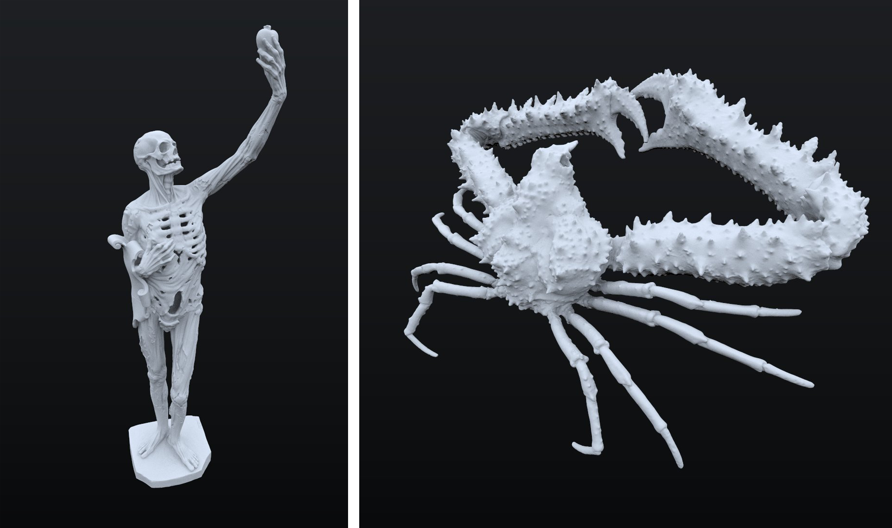

# three-shader-pathtracing

Sandbox project using [three-mesh-bvh](https://github.com/gkjohnson/three-mesh-bvh) to accelerate path tracing on the GPU. Features include basic Lambertian shadering, support for textures, normal maps, emission, environment maps, tiled rendering, and more!

Lambert demo [here](https://gkjohnson.github.io/three-shader-pathtracing/example/bundle/lambert.html)!

<i>"Interior Scene" model by <a href="https://sketchfab.com/3d-models/interior-scene-45ddbbc4c2dc4f8ca9ed99da9a78326a">Allay Design</a></i>

<i>Perseverance Rover model by <a href="https://mars.nasa.gov/resources/25042/mars-perseverance-rover-3d-model/">NASA / JPL-Caltech</a></i>

<i>Sculpture scans model by <a href="https://threedscans.com">Threedscans</a></i>

