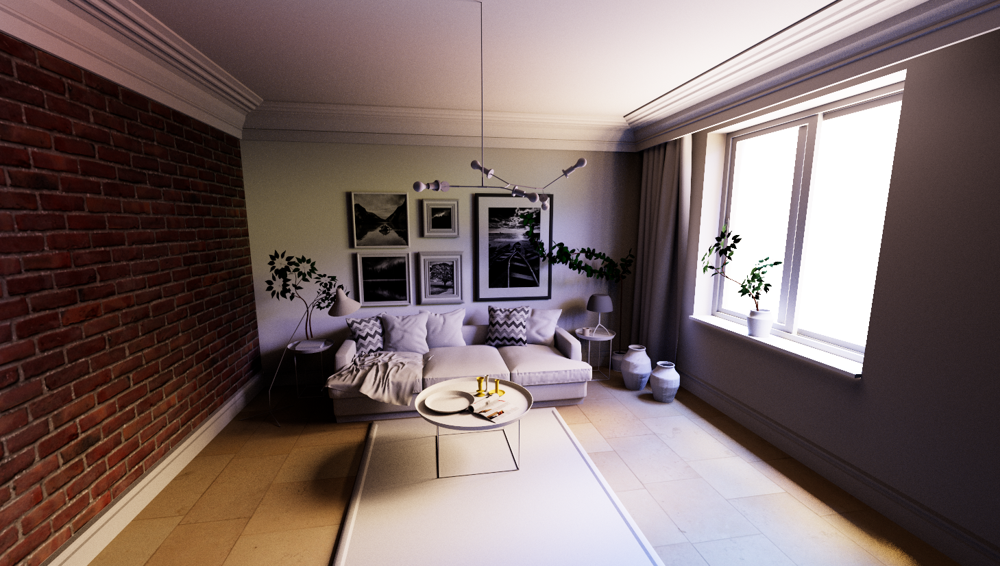

# three-gpu-pathtracer

[](https://www.npmjs.com/package/three-gpu-pathtracer)
[](https://lgtm.com/projects/g/gkjohnson/three-gpu-pathtracer/)
[](https://github.com/gkjohnson/three-gpu-pathtracer/actions)
[](https://github.com/gkjohnson/three-gpu-pathtracer/)
[](https://twitter.com/garrettkjohnson)
[](https://github.com/sponsors/gkjohnson/)


Path tracing project using [three-mesh-bvh](https://github.com/gkjohnson/three-mesh-bvh) and WebGL 2 to accelerate high quality, physically based rendering on the GPU. Features include support for GGX surface model, material information, textures, normal maps, emission, environment maps, tiled rendering, and more!

_More features and capabilities in progress!_

# Examples

**Beauty Demos**

[Physically Based Materials](https://gkjohnson.github.io/three-gpu-pathtracer/example/bundle/index.html)

[Lego Models](https://gkjohnson.github.io/three-gpu-pathtracer/example/bundle/lego.html)

[Interior Scene](https://gkjohnson.github.io/three-gpu-pathtracer/example/bundle/interior.html)

[Depth of Field](https://gkjohnson.github.io/three-gpu-pathtracer/example/bundle/depthOfField.html)

**Features**

[Skinned Geometry Support](https://gkjohnson.github.io/three-gpu-pathtracer/example/bundle/skinnedMesh.html)

[Morph Target Support](https://gkjohnson.github.io/three-gpu-pathtracer/example/bundle/skinnedMesh.html#morphtarget)

[Area Light Support](https://gkjohnson.github.io/three-gpu-pathtracer/example/bundle/areaLight.html)

**Test Scenes**

[Material Test Orb](https://gkjohnson.github.io/three-gpu-pathtracer/example/bundle/materialBall.html)

[Transmission Preset Orb](https://gkjohnson.github.io/three-gpu-pathtracer/example/bundle/materialBall.html#transmission)

[Model Viewer Fidelity Scene Comparisons](https://gkjohnson.github.io/three-gpu-pathtracer/example/bundle/viewerTest.html#khronos-DragonAttenuation)

**Light Baking**

[Ambient Occlusion Material](https://gkjohnson.github.io/three-gpu-pathtracer/example/bundle/aoRender.html)

# Use

**Basic Renderer**

```js
import * as THREE from 'three';
import { FullScreenQuad } from 'three/examples/jsm/postprocessing/Pass.js';
import {
	PathTracingSceneGenerator,
	PathTracingRenderer,
	PhysicalPathTracingMaterial,
} from 'three-gpu-pathtracer';

// init scene, renderer, camera, controls, etc

renderer.outputEncoding = THREE.sRGBEncoding;
renderer.toneMapping = THREE.ACESFilmicToneMapping;

// initialize the path tracing material and renderer
const ptMaterial = new PhysicalPathTracingMaterial();
const ptRenderer = new PathTracingRenderer( renderer );
ptRenderer.setSize( window.innerWidth, window.innerHeight );
ptRenderer.camera = camera;
ptRenderer.material = ptMaterial;

// if rendering transparent background
ptRenderer.alpha = true;

// init quad for rendering to the canvas
const fsQuad = new FullScreenQuad( new THREE.MeshBasicMaterial( {
	map: ptRenderer.target.texture,

	// if rendering transparent background
	blending: THREE.CustomBlending,
} ) );

// ensure scene matrices are up to date
scene.updateMatrixWorld();

// initialize the scene and update the material properties with the bvh, materials, etc
const generator = new PathTracingSceneGenerator();
const { bvh, textures, materials, lights } = generator.generate( scene );

// update bvh and geometry attribute textures
ptMaterial.bvh.updateFrom( bvh );
ptMaterial.normalAttribute.updateFrom( geometry.attributes.normal );
ptMaterial.tangentAttribute.updateFrom( geometry.attributes.tangent );
ptMaterial.uvAttribute.updateFrom( geometry.attributes.uv );

// update materials and texture arrays
ptMaterial.materialIndexAttribute.updateFrom( geometry.attributes.materialIndex );
ptMaterial.textures.setTextures( renderer, 2048, 2048, textures );
ptMaterial.materials.updateFrom( materials, textures );

// update the lights
ptMaterial.lights.updateFrom( lights );
ptMaterial.lightCount = lights.length;

// set the environment map
const texture = await new RGBELoader().loadAsync( envMapUrl );
ptRenderer.material.envMapInfo.updateFrom( texture );

animate();

// ...

function animate() {

	// if the camera position changes call "ptRenderer.reset()"

	// update the camera and render one sample
	camera.updateMatrixWorld();
	ptRenderer.update();

	// if using alpha = true then the target texture will change every frame
	// so we must retrieve it before render.
	fsQuad.material.map = ptRenderer.target.texture;

	// copy the current state of the path tracer to canvas to display
	fsQuad.render( renderer );

}
```

**Blurred Environment Map**

Using a pre blurred envioronment map can help improve frame convergence time at the cost of sharp environment reflections. If performance is concern then multiple importance sampling can be disabled and blurred environment map used.

```js
import { BlurredEnvMapGenerator } from 'three-gpu-pathtracer';

// ...

const envMap = await new RGBELoader().loadAsync( envMapUrl );
const generator = new BlurredEnvMapGenerator( renderer );
const blurredEnvMap = generator.generate( envMap, 0.35 );

// render!

```

## Dynamic Scenes

Using the dynamic scene generator the same, frequently updated scene can be converted into a single reusable geometry multiple times and BVH refit which greatly improves subsequent scene updates. See `DynamicPathTracingSceneGenerator` docs for more info.

```js
import { DynamicPathTracingSceneGenerator } from 'three-gpu-pathtracer';

// ... initialize scene etc

const generator = new DynamicPathTracingSceneGenerator( scene );
const { bvh, textures, materials } = generator.generate( scene );

// ... update path tracer and render
```

## Asynchronous Scene Generation

_NOTE WebWorker syntax is inconsistently supported across bundlers and sometimes not supported at all so the PathTracingSceneWorker class is not exported from the package root. If needed the code from src/worker can be copied and modified to accomodate a particular build process._

```js
import { PathTracingSceneWorker } from 'three-gpu-pathtracer/src/workers/PathTracingSceneWorker.js';

// ...

// initialize the scene and update the material properties with the bvh, materials, etc
const generator = new PathTracingSceneWorker();
const { bvh, textures, materials, lights } = await generator.generate( scene );

// ...
```

# Exports

## PathTracingRenderer

Utility class for tracking and rendering a path traced scene to a render target.

### .samples

```js
readonly samples : Number
```

Number of samples per pixel that have been rendered to the target.

### .target

```js
readonly target : WebGLRenderTarget
```

The target being rendered to. The size of the target is updated with `setSize` and is initialized to a FloatType texture.

### .camera

```js
camera = null : Camera
```

The camera to render with. The view offset of the camera will be updated every sample to enable anti aliasing.

### .material

```js
material = null : ShaderMaterial
```

The Path Tracing material to render. This is expected to be a full screen quad material that respects the "opacity" field for every pixel so samples can be accumulated over time. The material is also expected to have `cameraWorldMatrix` and `invProjectionMatrix` fields of type `Matrix4`.

### .tiles

```js
tiles = ( 1, 1 ) : Vector2
```

Number of tiles on x and y to render to. Can be used to improve the responsiveness of a page while still rendering a high resolution target.

### .stableNoise

```js
stableNoise = false : Boolean
```

Whether to reset the random seed to `0` when restarting the render. If true then a consistent random sample pattern will appear when moving the camera, for example.

### .alpha

```js
alpha = false : Boolean
```

Whether to support rendering scenes with transparent backgrounds. When transparent backgrounds are used two extra render targets are used, custom blending is performed, and PathTracingRenderer.target will change on every completed sample.

### constructor

```js
constructor( renderer : WebGLRenderer )
```

### .setSize

```js
setSize( size : Vector2 ) : void
```

Sets the size of the target to render to.

### .update

```js
update()
```

Renders a single sample to the target.

### .reset

```js
reset() : void
```

Resets and restarts the render from scratch.

## PathTracingSceneGenerator

Utility class for generating the set of data required for initializing the path tracing material with a bvh, geometry, materials, and textures.

### .generate

```js
generate( scene : Object3D, options = {} : Object ) : {
	bvh : MeshBVH,
	materials : Array<Material>,
	textures : Array<Texture>,
	lights : Array<Light>
}
```

Merges the geometry in the given scene with an additional "materialIndex" attribute that references the associated material array. Also produces a set of textures referenced by the scene materials.

## PathTracingSceneWorker

_extends PathTracingSceneGenerator_

See note in [Asyncronous Generation](#asynchronous-generation) use snippet.

### .generate

```js
async generate( scene : Object3D, options = {} : Object ) : {
	bvh : MeshBVH,
	materials : Array<Material>,
	textures : Array<Texture>,
	lights : Array<Light>
}
```

### .dispose

```js
dispose() : void
```

## PhysicalCamera

_extends THREE.PerspectiveCamera_

An extension of the three.js PerspectiveCamera with some other parameters associated with depth of field. These parameters otherwise do not affect the camera behavior are are for convenience of use with the PhysicalCameraUniform and pathtracer.

### .focusDistance

```js
focusDistance = 25 : Number
```

The distance from the camera in meters that everything is is perfect focus.

### .fStop

```js
fStop = 1.4 : Number
```

The fstop value of the camera. If this is changed then the `bokehSize` field is implicitly updated.

### .bokehSize

```js
bokehSize : Number
```

The bokeh size as derived from the fStop and focal length in millimeters. If this is set then the fStop is implicitly updated.

### .apertureBlades

```js
apertureBlades = 0 : Number
```

The number of sides / blades on the aperture.

### .apertureRotation

```js
apertureRotation = 0 : Number
```

The rotation of the aperture shape in radians.

### .anamorphicRatio

```js
anamorphicRatio = 1 : Number
```

The anamorphic ratio of the lens. A higher value will stretch the bokeh effect horizontally.

## EquirectCamera

_extends THREE.Camera_

A class indicating that the path tracer should render an equirectangular view. Does not work with three.js raster rendering.

## DynamicPathTracingSceneGenerator

A variation of the path tracing scene generator intended for quickly regenerating a scene BVH representation that updates frequently. Ie those with animated objects or animated skinned geometry.

In order to quickly update a dynamic scene the same BVH is reused across updates by refitting rather than regenerating. This is significantly faster but also results in a less optimal BVH after significant changes.

If geometry or materials are added or removed from the scene then `reset` must be called.

### constructor

```js
constructor( scene : Object3D )
```

Takes the scene to convert.

### .generate

```js
generate() : {
	bvh : MeshBVH,
	materials : Array<Material>,
	textures : Array<Texture>
}
```

Generates and refits the bvh to the current scene state. The same bvh, materials, and textures objects are returns after the initial call until `reset` is called.

### .reset

```js
reset() : void
```

Resets the generator so a new BVH is generated. This must be called when geometry, objects, or materials are added or removed from the scene.

## BlurredEnvMapGenerator

Utility for generating a PMREM blurred environment map that can be used with the path tracer.

### constructor

```js
constructor( renderer : WebGLRenderer )
```

### .generate

```js
generate( texture : Texture, blur : Number ) : DataTexture
```

Takes a texture to blur and the amount to blur it. Returns a new `DataTexture` that has been PMREM blurred environment map that can have distribution data generated for importance sampling.

### .dispose

```js
dispose() : void
```

Disposes of the temporary files and textures for generation.

## MaterialBase

_extends THREE.ShaderMaterial_

Convenience base class that adds additional functions and implicitly adds object definitions for all uniforms of the shader to the object.

### .setDefine

```js
setDefine( name : string, value = undefined : any ) : void
```

Sets the define of the given name to the provided value. If the value is set to null or undefined then it is deleted from the defines of the material. If the define changed from the previous value then `Material.needsUpdate` is set to `true`.

## PhysicalPathTracingMaterial

_extends MaterialBase_

**Uniforms**

```js
{
	// The number of ray bounces to test. Higher is better quality but slower performance.
	bounces = 3 : Number,

	// The physical camera parameters to use
	physicalCamera : PhysicalCameraUniform,

	// Geometry and BVH information
	bvh: MeshBVHUniformStruct,
	normalAttribute: FloatVertexAttributeTexture,
	tangentAttribute: FloatVertexAttributeTexture,
	uvAttribute: FloatVertexAttributeTexture,
	materialIndexAttribute: UIntVertexAttributeTexture,
	materials: MaterialsTexture,
	textures: RenderTarget2DArray,

	// Light information
	lights: LightsTexture,
	lightCount = 0: Number,

	// Environment Map information
	envMapInfo: EquirectHdrInfoUniform,
	environmentRotation: Matrix3,
	environmentIntensity = 1: Number,

	// background blur
	backgroundBlur = 0: Number,

	// Factor for alleviating bright pixels from rays that hit diffuse surfaces then
	// specular surfaces. Setting this higher alleviates fireflies but will remove some
	// specular caustics.
	filterGlossyFactor = 0: Number,

	// The colors to use for the gradient background when enabled.
	bgGradientTop: Color,
	bgGradientBottom: Color,

	// The transparency to render the background with. Note that the "alpha" option
	// must be set to true on PathTracingRenderer for this field to work properly.
	backgroundAlpha: 1.0,
}
```

**Defines**

```js
{

	// Whether to use multiple importance sampling to help the image converge more quickly
	FEATURE_MIS = 1 : Number,

	// Whether to use the "bg" gradient fields to sample for the background
	FEATURE_GRADIENT_BG = 0 : Number

	// The number of transparent pixels to allow on top of existing bounces for object transparency.
	TRANSPARENT_TRAVERSALS = 5 : Number,

}
```

## RenderTarget2DArray

_extends WebGLArrayRenderTarget_

A convenience extension from `WebGLArrayRenderTarget` that affords easily creating a uniform texture array from an array of textures.

### .setTextures

```js
setTextures(
	renderer : WebGLRenderer,
	width : Number,
	height : Number,
	textures : Array<Texture>
) : void
```

Takes the rendering context to updateh the target for, the target dimensions of the texture array, and the array of textures to render into the 2D texture array. Every texture is stretched to the dimensions of the texture array at the same index they are provided in.

## PhysicalCameraUniform

Uniform for storing the camera parameters for use with the shader.

### .updateFrom

```js
updateFrom( camera : PerspectiveCamera | PhysicalCamera ) : void
```

Copies all fields from the passed PhysicalCamera if available otherwise the defaults are used.

## MaterialsTexture

_extends DataTexture_

Helper texture uniform for encoding materials as texture data.

### .threeCompatibilityTransforms

```js
threeCompatibilityTransforms = false : Boolean
```

Three.js materials support only a single set of UV transforms in a certain fallback priority while the pathtracer supports a unique set of transforms per texture. Set this field to true in order to use the same uv transform handling as three.js materials.

See fallback order documentation [here](https://threejs.org/docs/#api/en/textures/Texture.offset).

### .setSide

```js
setSide( index : Number, side : FrontSide | BackSide | DoubleSide ) : void
```

Sets the side to render for the given material.

### .setMatte

```js
setMatte( index : Number, matte : Boolean ) : void
```

Sets whether or not the material of the given index is matte or not. When "true" the background is rendered in place of the material.

### .setCastShadow

```js
setCastShadow( index : Number, enabled : Boolean ) : void
```

Sets whether or not the material of the given index will cast shadows. When "false" materials will not cast shadows on diffuse surfaces but will still be reflected. This is a good setting for lighting enclosed interiors with environment lighting.

### .updateFrom

```js
updateFrom( materials : Array<Material>, textures : Array<Texture> ) : void
```

Updates the size and values of the texture to align with the provided set of materials and textures.

The "matte" and "side" values must be updated explicitly.

## LightsTexture

_extends DataTexture_

Helper texture uniform for encoding lights as texture data.

### .updateFrom

```js
updateFrom( lights : Array<Light> ) : void
```

Updates the size and values of the texture to align with the provided set of lights.

## EquirectHdrInfoUniform

Stores the environment map contents along with the intensity distribution information to support multiple importance sampling.

### .updateFrom

```js
updateFrom( environmentMap : Texture ) : void
```

Takes an environment map to process into something usable by the path tracer. Is expected to be a DataTexture so the data can be read.

## Functions

### mergeMeshes

```js
mergeMeshes( meshes : Array<Mesh> ) : {
	materials : Array<Material>,
	textures : Array<Textures>,
	geometry : BufferGeometry
}
```

Merges the set of meshes into a single geometry with a `materialIndex` vertex attribute included on the geometry identifying the associated material in the returned `materials` array.

## Shader Chunks

**shaderMaterialSampling**

Set of functions for performing material scatter and PDF sampling. See the [implementation](https://github.com/gkjohnson/three-gpu-pathtracer/blob/main/src/shader/shaderMaterialSampling.js) for full list of functions.

**shaderLightSampling**

Set of functions for performing light sampling. See the [implementation](https://github.com/gkjohnson/three-gpu-pathtracer/blob/main/src/shader/shaderLightSampling.js) for full list of functions.

**shaderStructs**

Material and light struct definition for use with uniforms. See the [implementation](https://github.com/gkjohnson/three-gpu-pathtracer/blob/main/src/shader/shaderStructs.js) for full list of functions.

**shaderUtils**

Set of randomness and other light transport utilities for use in a shader. See the [implementation](https://github.com/gkjohnson/three-gpu-pathtracer/blob/main/src/shader/shaderUtils.js) for full list of functions.

# Gotchas

- The project requires use of WebGL2.
- All textures must use the same wrap and interpolation flags.

# Screenshots


<p align="center">
<i>Sample materials</i>
</p>


<p align="center">
<i>"SD Macross City Standoff Diorama" scene by <a href="https://sketchfab.com/3d-models/sd-macross-city-standoff-diorama-b154220f7e7441799d6be2f7ff9658c7">tipatat</a></i>
</p>



<p align="center">
<i>"Interior Scene" model by <a href="https://sketchfab.com/3d-models/interior-scene-45ddbbc4c2dc4f8ca9ed99da9a78326a">Allay Design</a></i>
</p>


<p align="center">
<i>Perseverance Rover, Ingenuity Helicopter models by <a href="https://mars.nasa.gov/resources/25042/mars-perseverance-rover-3d-model/">NASA / JPL-Caltech</a></i>
</p>


<p align="center">
<i>Gelatinous Cube model by <a href="https://sketchfab.com/3d-models/gelatinous-cube-e08385238f4d4b59b012233a9fbdca21">glenatron</a></i>
</p>


<p align="center">
<i>Lego models courtesy of the <a href="https://omr.ldraw.org/">LDraw Official Model Repository</a></i>
</p>


<p align="center">
<i>Octopus Tea model by <a href="https://sketchfab.com/3d-models/cartoon-octopus-takes-a-tea-bath-107260cf0fd24202a67eb037a6c760a5
">AzTiZ</a></i>
</p>


<p align="center">
<i>Botanists Study model by <a href="https://sketchfab.com/3d-models/the-botanists-study-8b7b5743b1c848ed8ea58f5518c44e7e">riikkakilpelainen</a></i>
</p>


<p align="center">
<i>Japanese Bridge Garden model by <a href="https://sketchfab.com/3d-models/japanese-bridge-garden-d122e17593eb4012913cde927486d15a">kristenlee</a></i>
</p>

### Resources

[Raytracing in One Weekend Book](https://raytracing.github.io/)

[PBR Book](https://pbr-book.org/)

[knightcrawler25/GLSL-PathTracer](https://github.com/knightcrawler25/GLSL-PathTracer/)


