# three-gpu-pathtracer

[](https://www.npmjs.com/package/three-gpu-pathtracer)
[](https://github.com/gkjohnson/three-gpu-pathtracer/actions)
[](https://github.com/gkjohnson/three-gpu-pathtracer/)
[](https://twitter.com/garrettkjohnson)
[](https://github.com/sponsors/gkjohnson/)

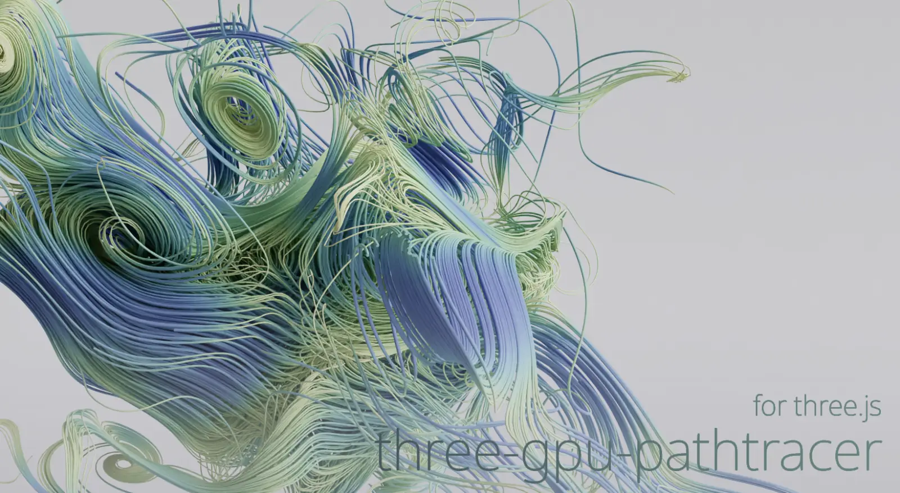

Path tracing project using [three-mesh-bvh](https://github.com/gkjohnson/three-mesh-bvh) and WebGPU compute shaders to accelerate high quality, physically based rendering on the GPU.

# Examples

**Setup**

[Basic glTF Setup Example](https://gkjohnson.github.io/three-gpu-pathtracer/basic.html)

[Basic Primitive Geometry Example](https://gkjohnson.github.io/three-gpu-pathtracer/primitives.html)

**Beauty Demos**

[Physically Based Materials](https://gkjohnson.github.io/three-gpu-pathtracer/index.html)

[Interior Scene w/ Equirect Rendering](https://gkjohnson.github.io/three-gpu-pathtracer/equirect.html)

[Depth of Field](https://gkjohnson.github.io/three-gpu-pathtracer/depthOfField.html)

[HDR Image](https://gkjohnson.github.io/three-gpu-pathtracer/hdr.html)

**Features**

[Area Light Support](https://gkjohnson.github.io/three-gpu-pathtracer/areaLight.html)

[Spot Light Support](https://gkjohnson.github.io/three-gpu-pathtracer/spotLights.html)

[Denoising and Upscaling](https://gkjohnson.github.io/three-gpu-pathtracer/denoise.html)

**Test Scenes**

[Material Test Orb](https://gkjohnson.github.io/three-gpu-pathtracer/materialOrb.html)

[Model Viewer Fidelity Scene Comparisons](https://gkjohnson.github.io/three-gpu-pathtracer/viewerTest.html)

**Tools**

[Animation Rendering](https://gkjohnson.github.io/three-gpu-pathtracer/renderVideo.html)

## Running examples locally

To run and modify the examples locally, make sure you have Node and NPM installed. Check the supported versions in [the test configuration](./.github/workflows/node.js.yml).

- To install dependencies, run `npm install`
- To start the demos run `npm start`
- Visit `http://localhost:5173/<demo-name.html>`

# Use

**Basic Renderer**

```js
import * as THREE from 'three/webgpu';
import { WebGPUPathTracer } from 'three-gpu-pathtracer/webgpu';

// init scene, camera, controls, etc

renderer = new THREE.WebGPURenderer();
renderer.toneMapping = THREE.ACESFilmicToneMapping;
await renderer.init();

pathTracer = new WebGPUPathTracer( renderer );
pathTracer.setScene( scene, camera );

animate();

function animate() {

	requestAnimationFrame( animate );
	pathTracer.renderSample();

}
```

**Blurred Environment Map**

Using a pre blurred environment map can help improve frame convergence time at the cost of sharp environment reflections. If performance is a concern then multiple importance sampling can be disabled and a blurred environment map used.

```js
import { BlurredEnvMapGenerator } from 'three-gpu-pathtracer/webgpu';

// ...

const envMap = await new HDRLoader().loadAsync( envMapUrl );
const generator = new BlurredEnvMapGenerator( renderer );
const blurredEnvMap = await generator.generate( envMap, 0.35 );
generator.dispose();

scene.environment = blurredEnvMap;

// render!

```

# API

See [API.md](./src/webgpu/API.md) for the WebGPU API documentation.

# Gotchas

- The project requires WebGPU.
- SpotLights, DirectionalLights, and PointLights are only supported with MIS.
- Only MeshStandardMaterial and MeshPhysicalMaterial are supported.
- Emissive materials are supported but do not take advantage of MIS.

# Screenshots

<p align="center">
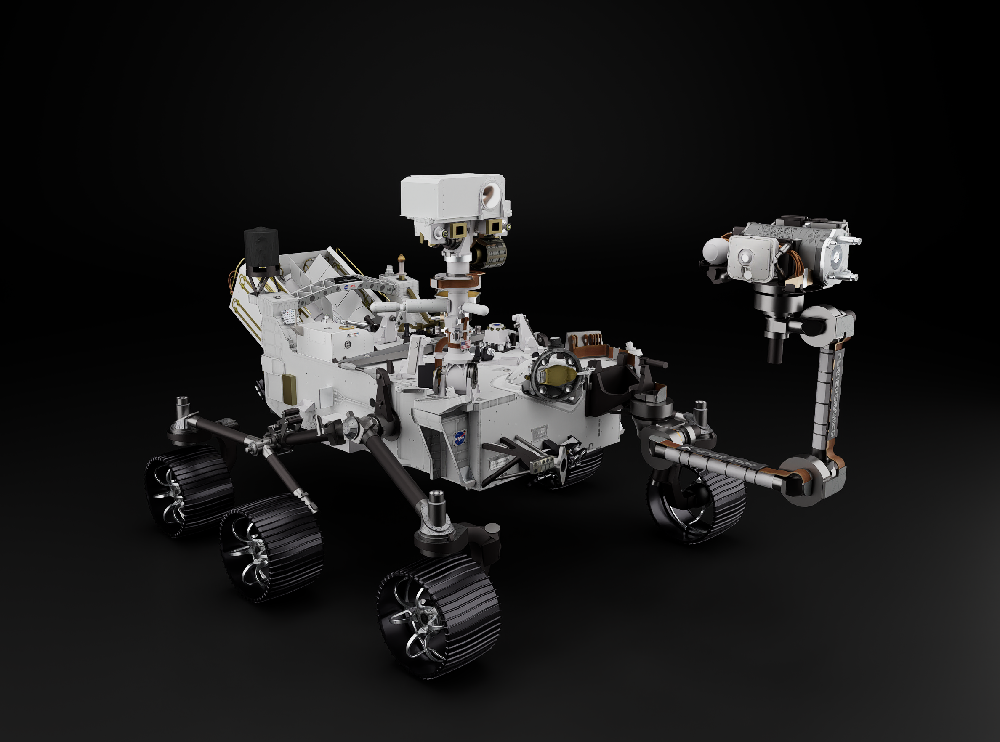
</p>

<p align="center">
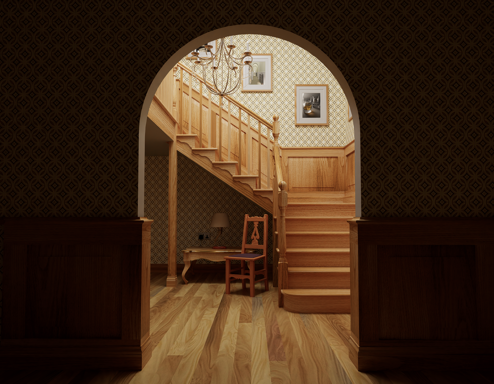
</p>

<p align="center">
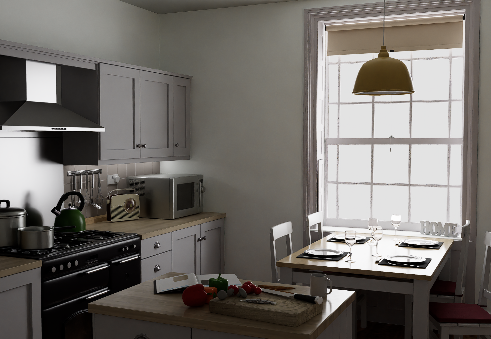
</p>

<p align="center">
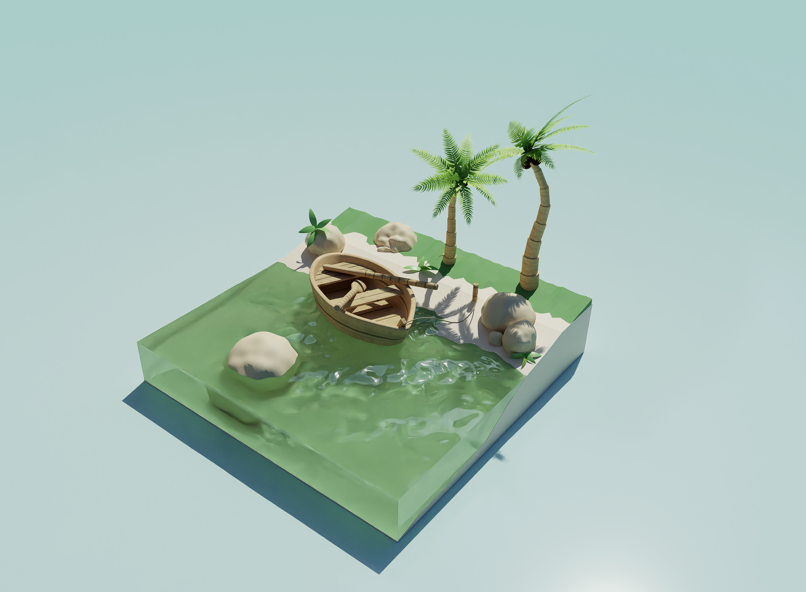
</p>

<p align="center">
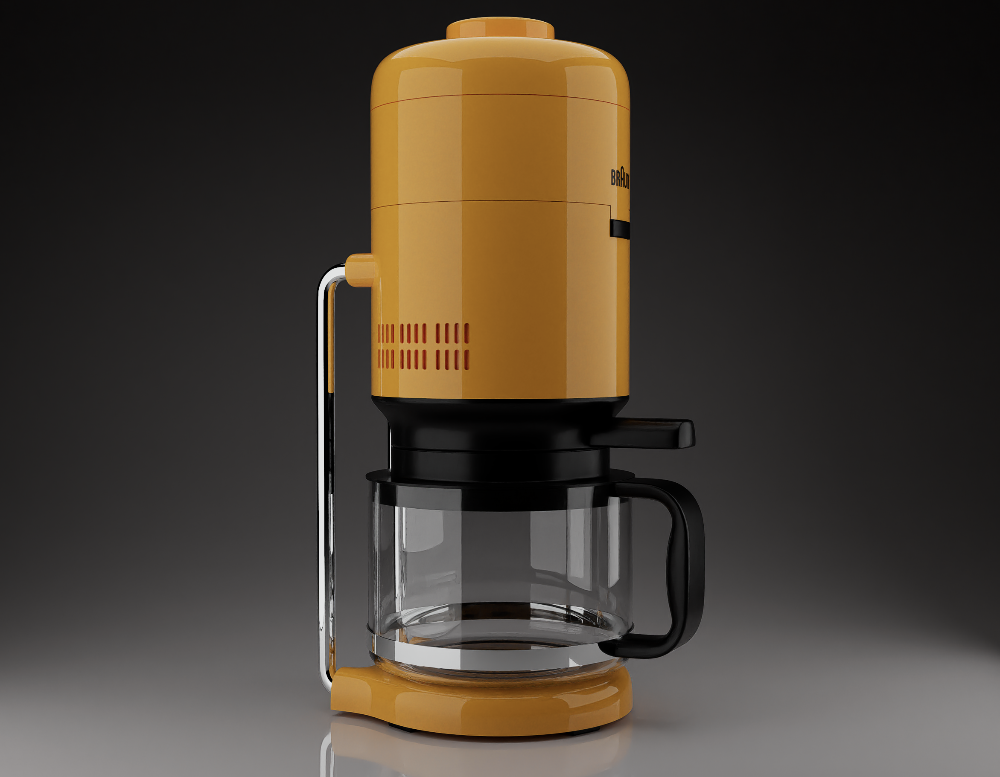
</p>

<p align="center">
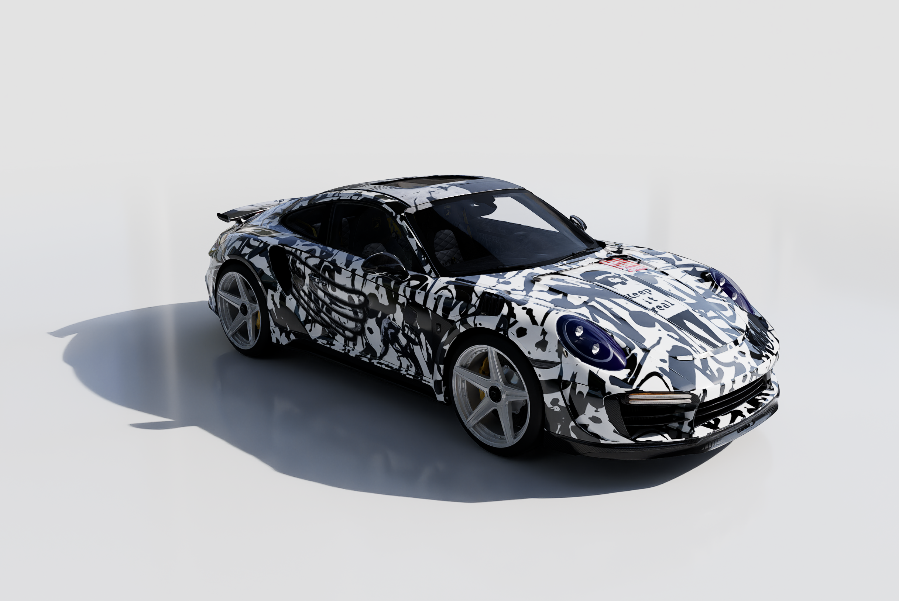
</p>

<p align="center">
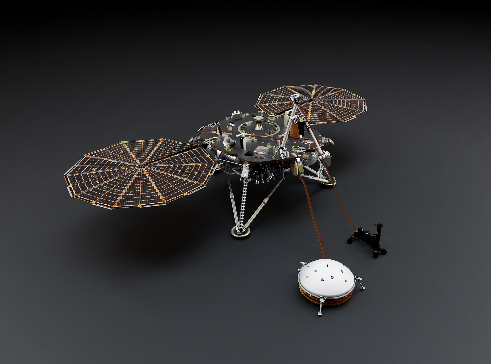
</p>

<p align="center">
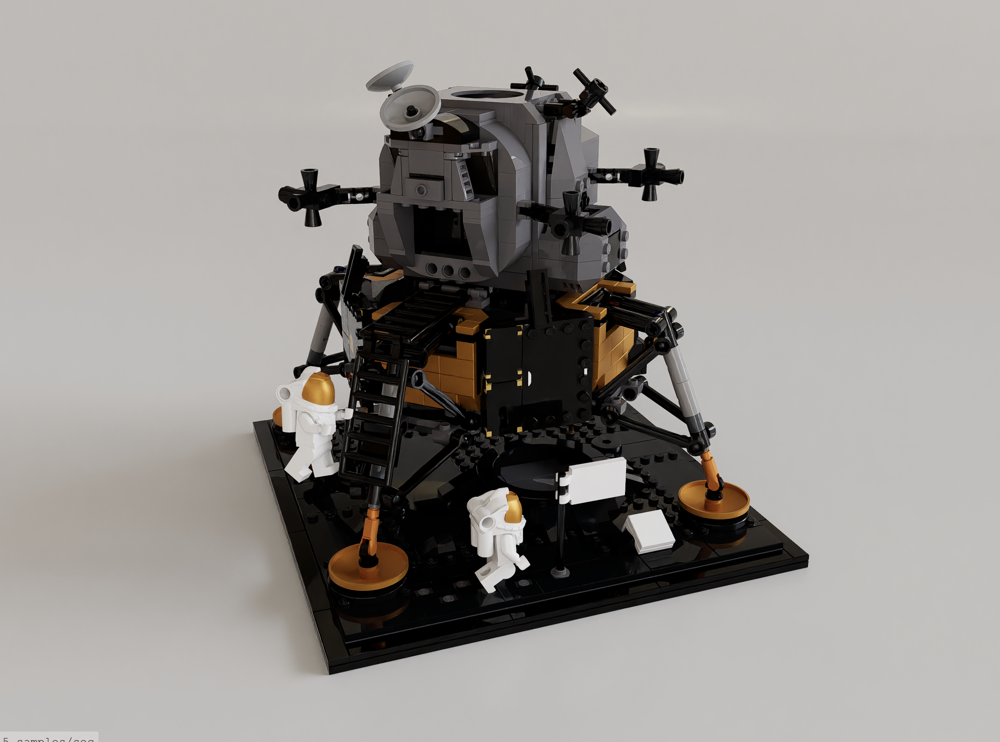
</p>

<p align="center">
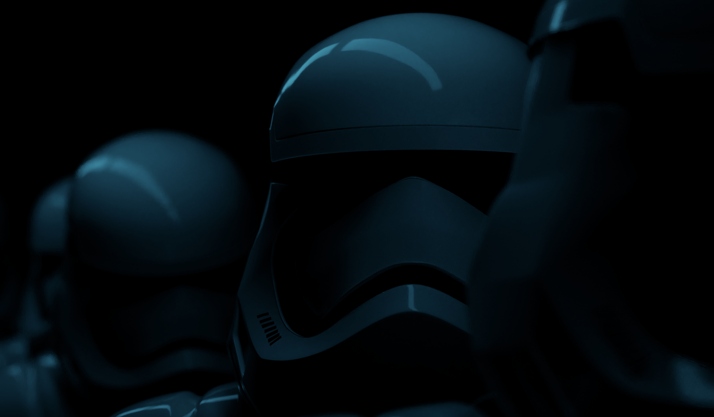
</p>

<p align="center">

</p>

<p align="center">
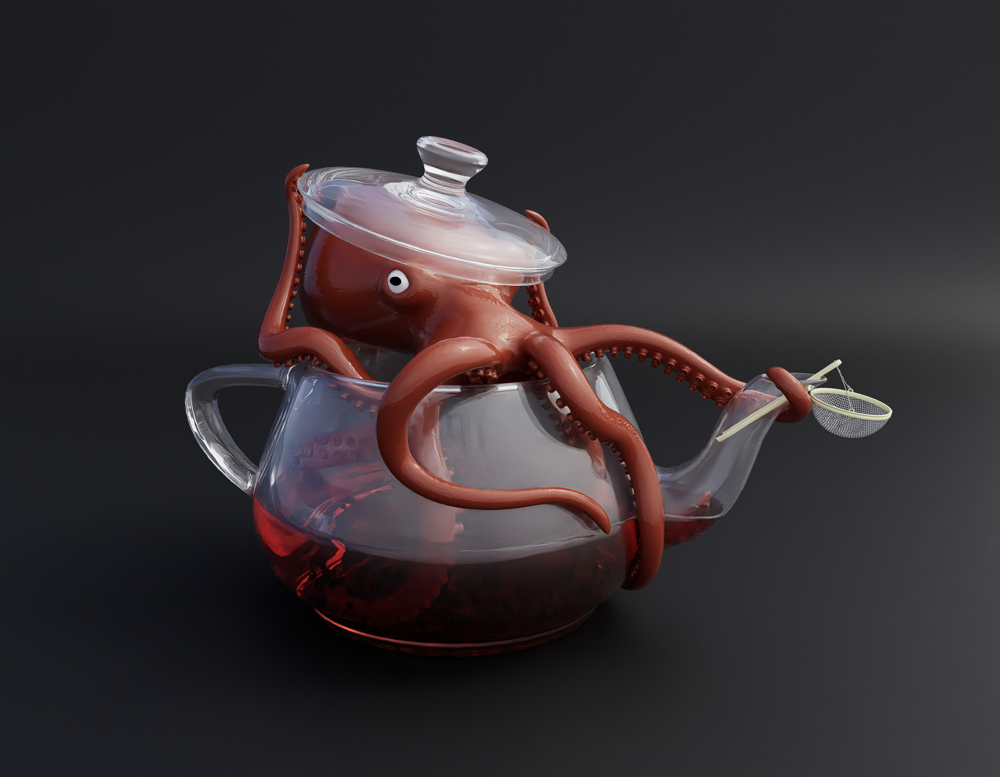
</p>

<p align="center">

</p>

### Resources

[Raytracing in One Weekend Book](https://raytracing.github.io/)

[PBR Book](https://pbr-book.org/)

[knightcrawler25/GLSL-PathTracer](https://github.com/knightcrawler25/GLSL-PathTracer/)

[blender/cycles](https://github.com/blender/cycles)

[AcademySoftwareFoundation/OpenPBR](https://github.com/AcademySoftwareFoundation/OpenPBR)


