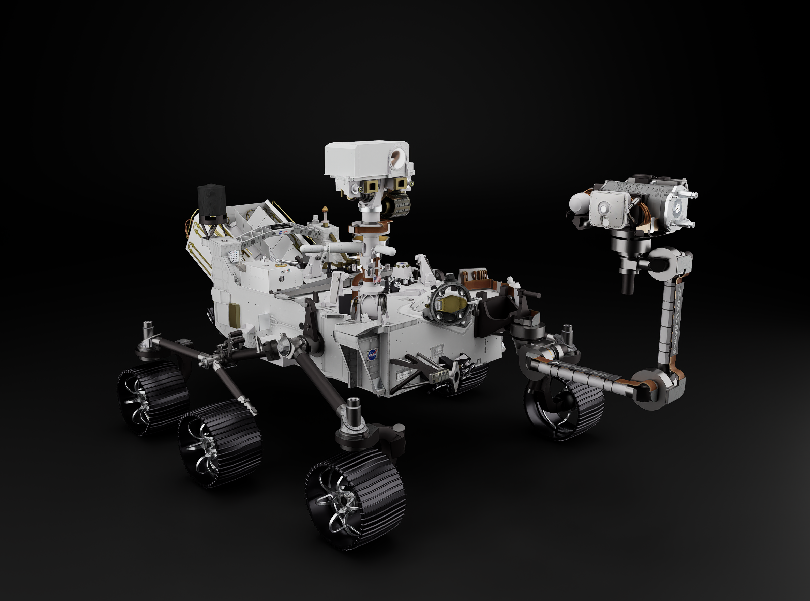
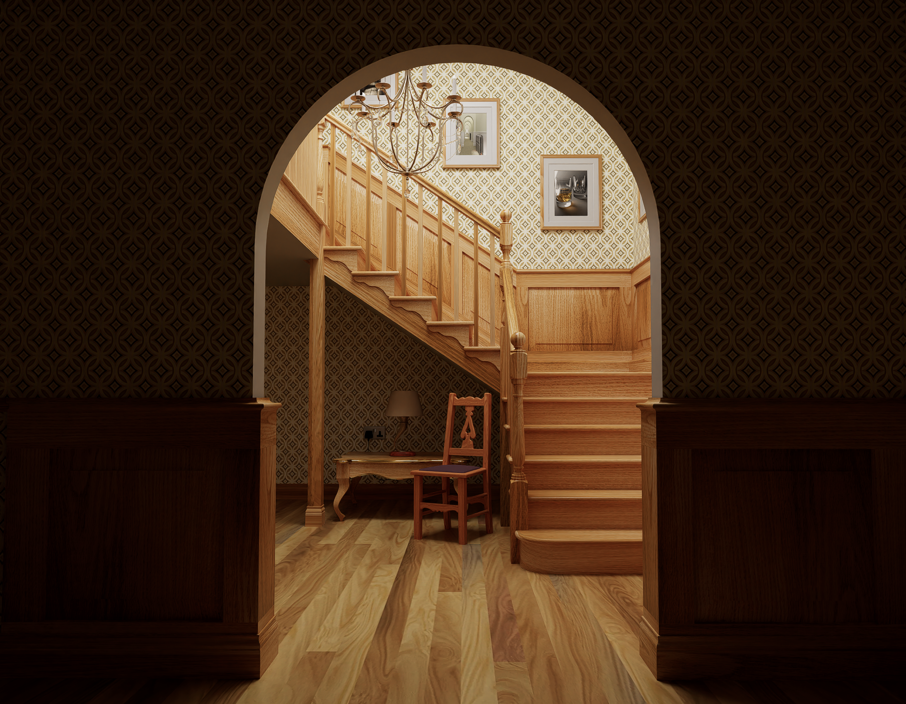
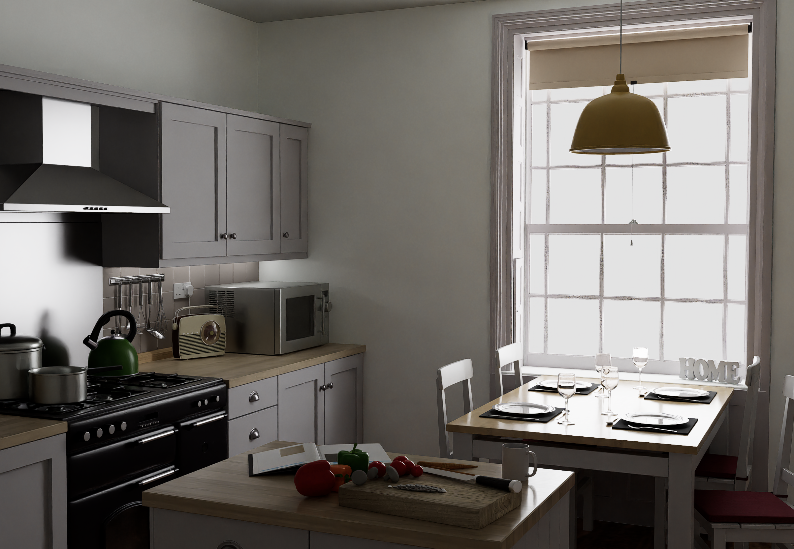
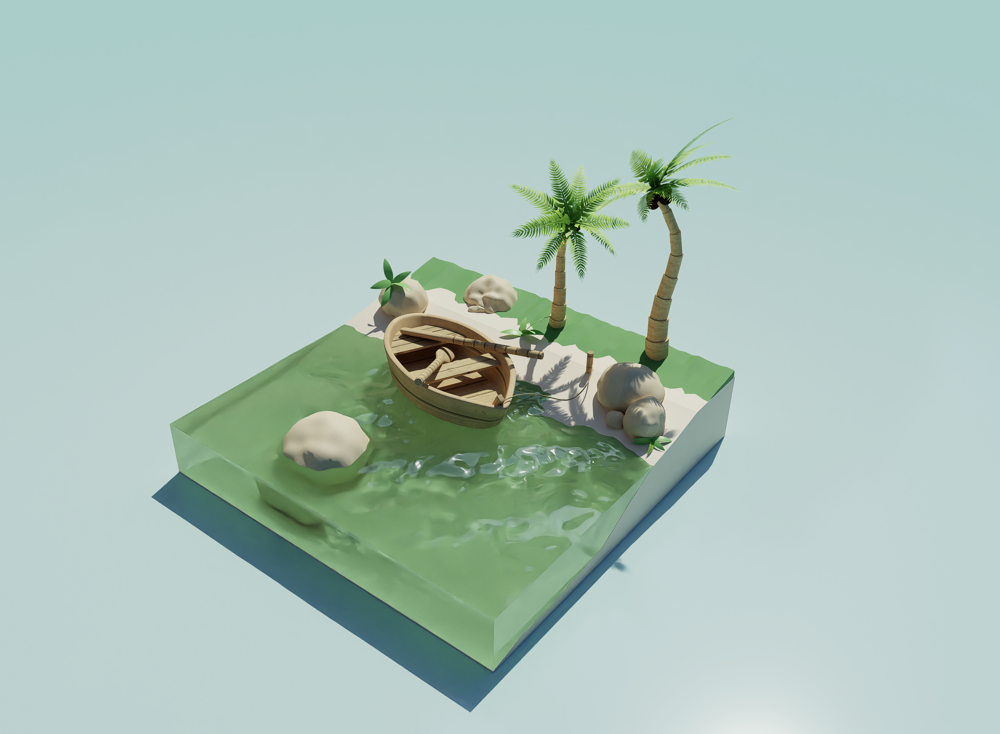
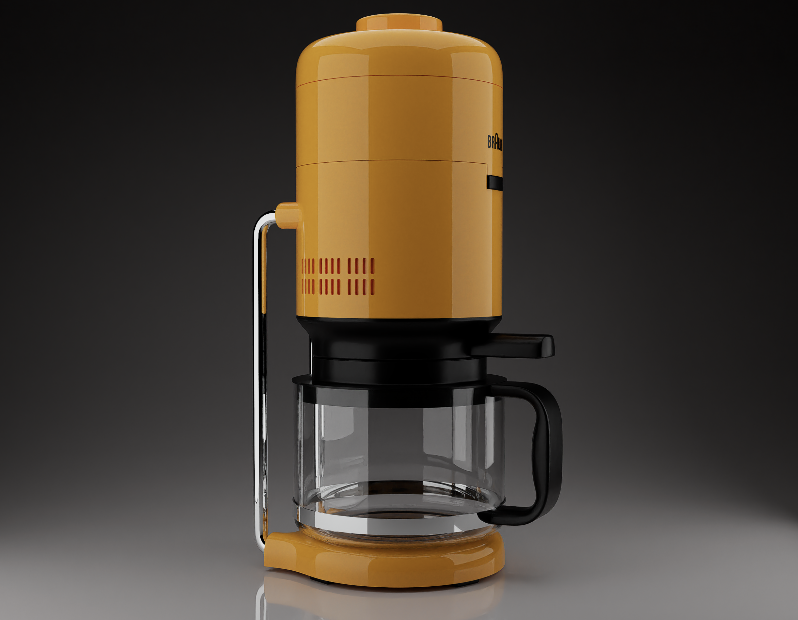
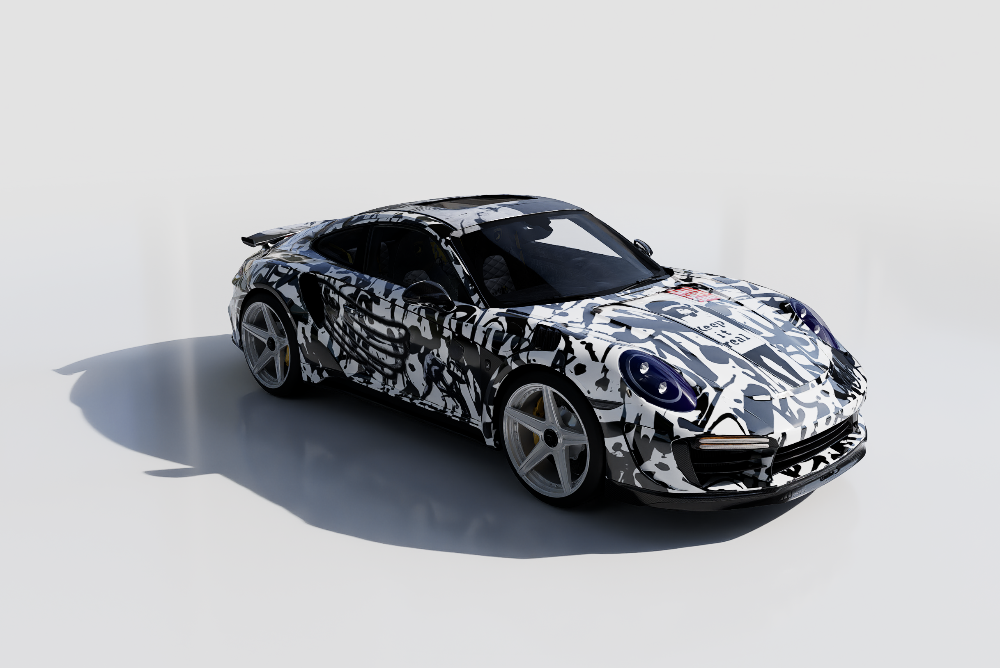
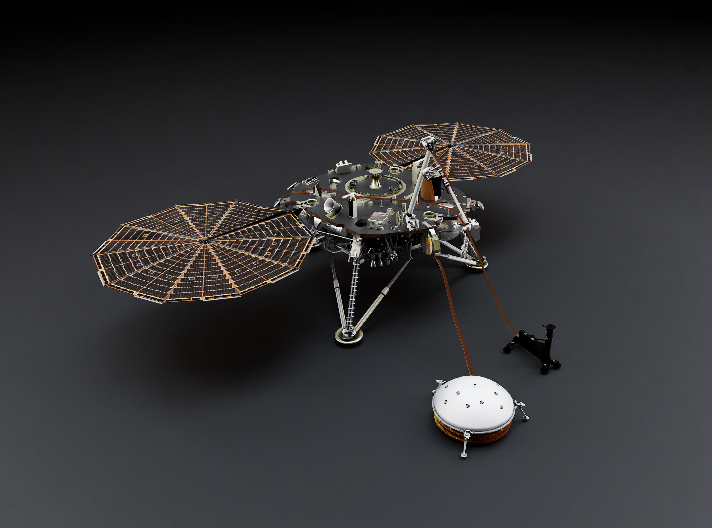
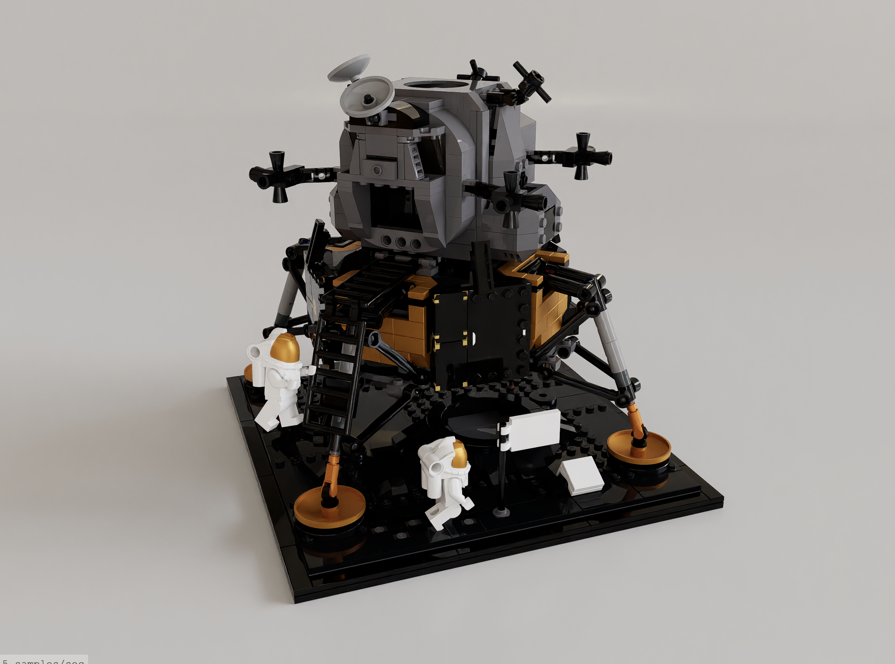
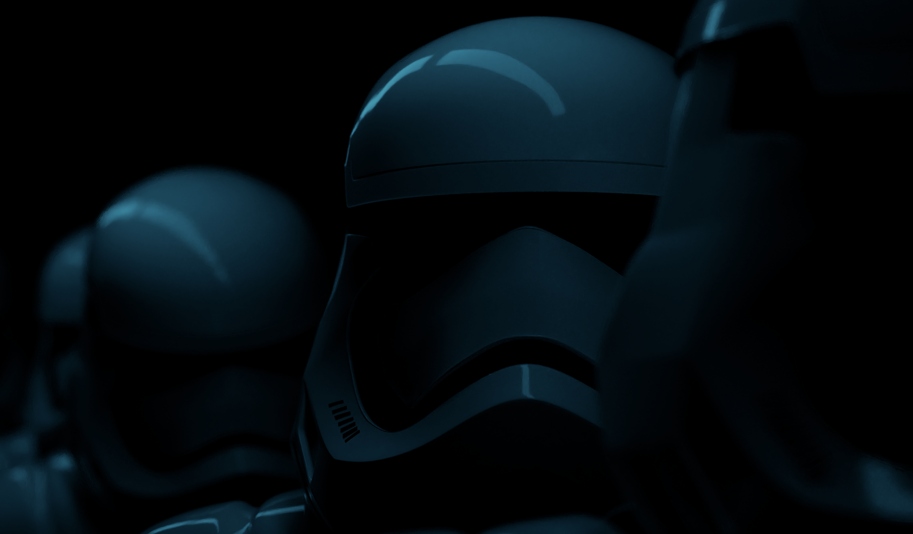
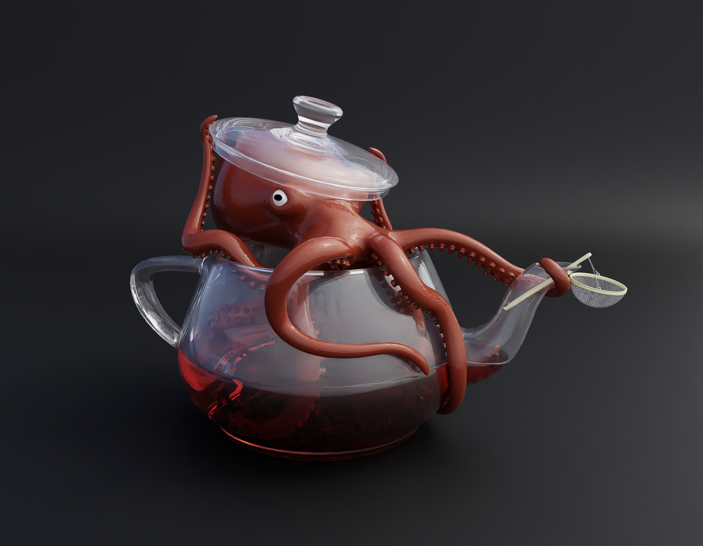

# three-gpu-pathtracer

[](https://www.npmjs.com/package/three-gpu-pathtracer)
[](https://github.com/gkjohnson/three-gpu-pathtracer/actions)
[](https://github.com/gkjohnson/three-gpu-pathtracer/)
[](https://twitter.com/garrettkjohnson)
[](https://github.com/sponsors/gkjohnson/)


Path tracing project using [three-mesh-bvh](https://github.com/gkjohnson/three-mesh-bvh) and WebGPU compute shaders to accelerate high quality, physically based rendering on the GPU.

_More features and capabilities in progress!_

# Examples

**Setup**

[Basic glTF Setup Example](https://gkjohnson.github.io/three-gpu-pathtracer/example/bundle/basic.html)

[Basic Primitive Geometry Example](https://gkjohnson.github.io/three-gpu-pathtracer/example/bundle/primitives.html)

**Beauty Demos**

[Physically Based Materials](https://gkjohnson.github.io/three-gpu-pathtracer/example/bundle/index.html)

[Interior Scene w/ Equirect Rendering](https://gkjohnson.github.io/three-gpu-pathtracer/example/bundle/equirect.html)

[Depth of Field](https://gkjohnson.github.io/three-gpu-pathtracer/example/bundle/depthOfField.html)

[HDR Image](https://gkjohnson.github.io/three-gpu-pathtracer/example/bundle/hdr.html)

**Features**

[Skinned Geometry Support](https://gkjohnson.github.io/three-gpu-pathtracer/example/bundle/skinnedMesh.html)

[Morph Target Support](https://gkjohnson.github.io/three-gpu-pathtracer/example/bundle/skinnedMesh.html#morphtarget)

[Area Light Support](https://gkjohnson.github.io/three-gpu-pathtracer/example/bundle/areaLight.html)

[Spot Light Support](https://gkjohnson.github.io/three-gpu-pathtracer/example/bundle/spotLights.html)

[Volumetric Fog Support](https://gkjohnson.github.io/three-gpu-pathtracer/example/bundle/fog.html)

[Denoising and Upscaling](https://gkjohnson.github.io/three-gpu-pathtracer/example/bundle/denoise.html)

**Test Scenes**

[Material Test Orb](https://gkjohnson.github.io/three-gpu-pathtracer/example/bundle/materialOrb.html)

[Model Viewer Fidelity Scene Comparisons](https://gkjohnson.github.io/three-gpu-pathtracer/example/bundle/viewerTest.html)

**Tools**

[Animation Rendering](https://gkjohnson.github.io/three-gpu-pathtracer/example/bundle/renderVideo.html)

## Running examples locally

To run and modify the examples locally, make sure you have Node and NPM installed.  Check the supported versions in [the test configuration](./.github/workflows/node.js.yml).

In order to install dependencies, you will need `make` and a C++ compiler available.

On Debian or Ubuntu, run `sudo apt install build-essential`.  It should just work on MacOS.

- To install dependencies, run `npm install`
- To start the demos run `npm start`
- Visit `http://localhost:1234/<demo-name.html>`

# Use

**Basic Renderer**

```js
import * as THREE from 'three';
import { WebGLPathTracer } from 'three-gpu-pathtracer';

// init scene, camera, controls, etc

renderer = new THREE.WebGLRenderer();
renderer.toneMapping = THREE.ACESFilmicToneMapping;

pathTracer = new WebGLPathTracer( renderer );
pathTracer.setScene( scene, camera );

animate();

function animate() {

	requestAnimationFrame( animate );
	pathTracer.renderSample();

}
```

**Blurred Environment Map**

Using a pre blurred envioronment map can help improve frame convergence time at the cost of sharp environment reflections. If performance is concern then multiple importance sampling can be disabled and blurred environment map used.

```js
import { BlurredEnvMapGenerator } from 'three-gpu-pathtracer';

// ...

const envMap = await new HDRLoader().setDataType( THREE.FloatType ).loadAsync( envMapUrl );
const generator = new BlurredEnvMapGenerator( renderer );
const blurredEnvMap = generator.generate( envMap, 0.35 );

// render!

```

# API

See [API.md](./src/webgpu/API.md) for the WebGPU API documentation.

# Gotchas

- The project requires WebGPU.
- SpotLights, DirectionalLights, and PointLights are only supported with MIS.
- Only MeshStandardMaterial and MeshPhysicalMaterial are supported.
- Emissive materials are supported but do not take advantage of MIS.

# Screenshots

<p align="center">

</p>

<p align="center">

</p>

<p align="center">

</p>

<p align="center">

</p>

<p align="center">

</p>

<p align="center">

</p>

<p align="center">

</p>

<p align="center">

</p>

<p align="center">

</p>

<p align="center">

</p>

<p align="center">

</p>

<p align="center">

</p>

### Resources

[Raytracing in One Weekend Book](https://raytracing.github.io/)

[PBR Book](https://pbr-book.org/)

[knightcrawler25/GLSL-PathTracer](https://github.com/knightcrawler25/GLSL-PathTracer/)

[blender/cycles](https://github.com/blender/cycles)

[AcademySoftwareFoundation/OpenPBR](https://github.com/AcademySoftwareFoundation/OpenPBR)


